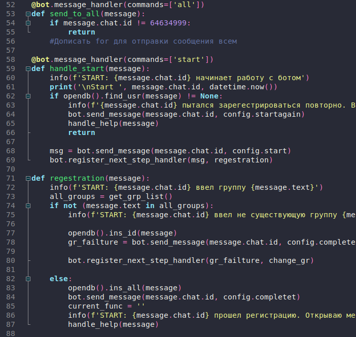

# Dracula for [Geany](https://www.geany.org/)

> A dark theme for [Geany](https://www.geany.org/).

## Install

All instructions can be found at [draculatheme.com/geany](https://draculatheme.com/geany).

## Team

This theme is maintained by the following person and a bunch of [awesome contributors](https://github.com/dracula/geany/graphs/contributors).

|  |
| ------------------------------------------------------------------------------------------------------------ |
| [sergey27564](https://github.com/sergey27564)                                                                |

## Community

- [Twitter](https://twitter.com/draculatheme) - Best for getting updates about themes and new stuff.
- [GitHub](https://github.com/dracula/dracula-theme/discussions) - Best for asking questions and discussing issues.
- [Discord](https://draculatheme.com/discord-invite) - Best for hanging out with the community.

## License

[MIT License](./LICENSE)
